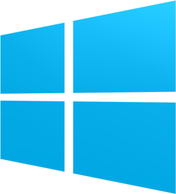
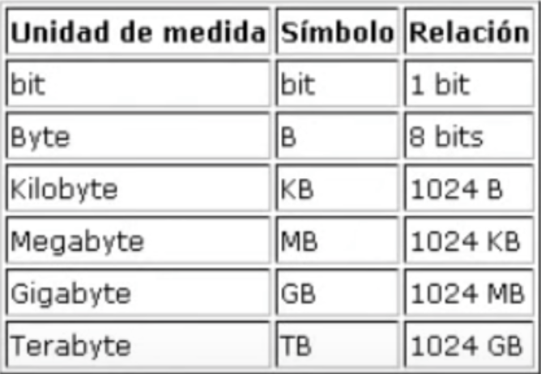

## ¿Qué hace un sistema operativo?

Un sistema operativo (SO) es el software principal que administra la computadora. Sus funciones principales son:

- Administrar hardware (CPU, memoria, disco, dispositivos).

- Proveer una interfaz entre el usuario y la máquina.

- Gestionar procesos (programas en ejecución).

- Administrar archivos y almacenamiento.

- Controlar la seguridad y permisos.

- Coordinar entrada y salida (teclado, mouse, pantalla, red).

## ¿Qué es el Open Source?

Open Source significa que:

- El código fuente de un programa está disponible para que cualquiera pueda verlo, modificarlo y distribuirlo.

- Normalmente es gratuito, pero no siempre.

- Fomenta colaboración y transparencia.

Ejemplos: Linux, Firefox, VLC, LibreOffice.

## Historia de los sistemas operativos Mac OS, Ubuntu y Windows
#### Mac OS


1984: Apple lanza el primer Macintosh con un sistema operativo gráfico innovador.

2001: Apple introduce Mac OS X, basado en UNIX, más estable y seguro.

- Evolucionó con versiones como Lion, Mavericks, Catalina, hasta macOS actual (Sonoma / Sequoia).

- Hoy es conocido por estabilidad, seguridad y uso profesional.

### Ubuntu


2004: Lanzado por Canonical, basado en Debian Linux.

- Diseñado para ser fácil, seguro y gratuito.

- Utiliza paquetes .deb y gestor APT.

- Se convirtió en una de las distribuciones Linux más populares para usuarios, servidores y la nube.

### Windows




1985: Microsoft lanza Windows 1.0, interfaz gráfica sobre MS-DOS.

- Versiones clave: Windows 95, XP, 7, 10, 11.

- Es el SO más usado en PCs por compatibilidad con programas y videojuegos.

-  Enfocado en facilidad de uso y soporte de hardware masivo.

## Comandos básicos de la terminal Unix (Mac o Ubuntu)

| Comando               | Descripción                  |
| --------------------- | ---------------------------- |
| `ls`                  | Lista archivos y carpetas    |
| `cd`                  | Cambia de directorio         |
| `pwd`                 | Muestra ruta actual          |
| `mkdir`               | Crea carpetas                |
| `rm`                  | Elimina archivos             |
| `rm -r`               | Elimina carpetas             |
| `cp origen destino`   | Copiar                       |
| `mv origen destino`   | Mover/renombrar              |
| `cat archivo`         | Mostrar contenido            |
| `touch archivo`       | Crear archivo vacío          |
| `sudo comando`        | Ejecutar como administrador  |
| `apt install paquete` | Instalar un paquete (Ubuntu) |

## Dispositivos de entrada/salida
### Entrada

Son los que envían datos a la computadora:

- Teclado

- Mouse

- Micrófono

- Cámara

- Escáner

- Pantalla táctil

### Salida

La computadora envía información al usuario:

- Monitor

- Impresora

- Bocinas

- Proyector

- Audífonos

### Entrada/Salida (I/O)

Pueden hacer ambas funciones:

- USB

- Pantalla táctil

- Tarjetas de red

- Disco duro / SSD

## Procesos y ejemplo de algoritmo de planeación

Un proceso es un programa en ejecución. El sistema operativo administra:

- CPU

- Memoria

- Cambios de proceso (context switch)

- Estados: nuevo, listo, ejecutando, bloqueado, terminado

### Algoritmos de planeación (el scheduling)

#### FCFS (First Come, First Served)

Atiende los procesos en el orden en que llegan.

Ventaja: es simple.

Desventaja: procesos cortos pueden llegar a esperar mucho.

## Almacenamiento

A lo largo del tiempo han existido muchos dispositivos electronicos que trabajan con unidades de almacenamiento. 

Ejemplos:

- Disco duro
- DVD
- CD
- pendrive
- tarjeta SD
- Memory Stick
- disco duro portátil
- Disquete



## Personajes importantes para los sistemas operativos
### Linus Torvalds

#### Creador de Linux (1991): 
- Desarrolló el kernel Linux, que hoy es la base de miles de sistemas operativos como Ubuntu, Android y Debian.

#### Modelo de desarrollo Open Source: 
- Impulsó la colaboración global a través del código abierto, cambiando la forma en la que se construye software en todo el mundo.

#### Git (2005): 
- Creó Git, el sistema de control de versiones más utilizado actualmente en proyectos de software.

### Dennis Ritchie

#### Creador del lenguaje C: 
- Diseñó el lenguaje de programación C, uno de los más influyentes y base de sistemas operativos, firmware y software moderno.

#### Co-creador de UNIX: 
- Participó en el diseño del sistema UNIX, que inspiró a Linux, MacOS, BSD y otros.

#### Impacto en la informática moderna: 
- Su trabajo sentó las bases de la mayoría de los sistemas operativos actuales.

## Instrucciones básicas para instalar Linux (Ubuntu)
### Descargar Ubuntu

- Ve a la página oficial: ubuntu.com/download

- Descarga la versión Ubuntu Desktop (archivo .iso).

### Crear USB booteable

- Descarga Rufus (Windows) o usa balenaEtcher (Windows, Mac o Linux).

- Inserta una memoria USB (mínimo 8GB).

#### En Rufus:

- Selecciona tu USB.

- Selecciona el archivo .iso de Ubuntu.

- Da clic en "Start".

### Configurar arranque desde USB

- Reinicia tu computadora.

- Entra al BIOS/UEFI presionando F2, F12, ESC o DEL (depende del equipo) en mi caso es el F12.

- En "Boot", selecciona tu USB como primera opción.

- Guarda y reinicia.

### Instalar Ubuntu

- Al iniciar la desde el USB, selecciona "Try or Install Ubuntu".

- Elige "Install Ubuntu".

- Selecciona idioma.

- Conéctate a Wi-Fi.

- Elige el tipo de instalación:

- Normal installation (recomendada).

- Decide si quieres instalar junto a Windows o borrar disco.

#### Configura:

- Zona horaria.

- Nombre y contraseña.

### Esperar la instalación

- El sistema copiará archivos y se configurará (tarda de 5–20 minutos).

- Al finalizar, presiona Restart Now.

- Retira el USB cuando lo pida.

### Primer inicio

- Inicia sesión con tu contraseña.

- Actualiza el sistema linux usando:

```bash sudo apt update && sudo apt upgrade ```